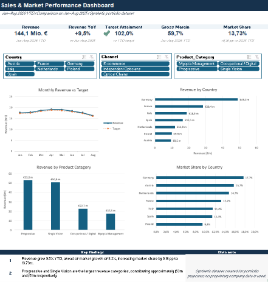

# Sales & Market Performance Dashboard

Interactive Excel dashboard for analyzing sales, profitability,
market performance, and target attainment across European markets.

## Dashboard

## Project Objective

The objective of this project was to build an interactive Excel management dashboard
for monitoring commercial performance across European markets.

The analysis focuses on:
- sales growth and target attainment
- profitability
- market share
- country and product performance
- channel performance
- year-over-year and YTD development

## Key Insights

- Revenue reached €144.1m in Jan–Aug 2026, up 9.5% versus the same period in 2025.
- Revenue growth exceeded market growth, increasing market share to 13.73% (+0.16 pp).
- Revenue target attainment reached 102.0%.
- Progressive and Single Vision were the largest product categories by revenue.
- Germany was the largest market by revenue and also recorded the highest market share.

## Key Features

- Interactive management dashboard
- Country, channel and product-category slicers
- PivotTable and PivotChart analysis
- YoY and YTD performance tracking
- Actual vs. target analysis
- Country, product and market-share benchmarking

## Key KPIs

- Revenue
- Revenue YoY
- Revenue Target Attainment
- Gross Margin
- Market Share

## Tools & Techniques

- Microsoft Excel
- PivotTables
- PivotCharts
- Slicers
- Structured References
- Calculated KPIs
- Conditional Formatting
- Data Cleaning

## Workbook Structure

- `Dashboard` — interactive management dashboard
- `Pivot_Analysis` — supporting country, product, channel and YoY analysis
- `Clean_Data` — validated dataset with calculated KPIs
- `Raw_Data` — original synthetic dataset
- `Data_Dictionary` — field definitions and KPI logic
- `Project_Brief` — project scope and business questions

## Dataset

Synthetic sales and market dataset covering multiple European
countries, sales channels and product categories.

The dataset is synthetic and created for portfolio purposes.

## Files

[Download the Excel workbook](./Sales_Market_Performance_Dashboard.xlsx)
